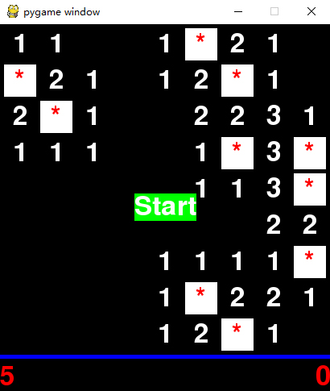
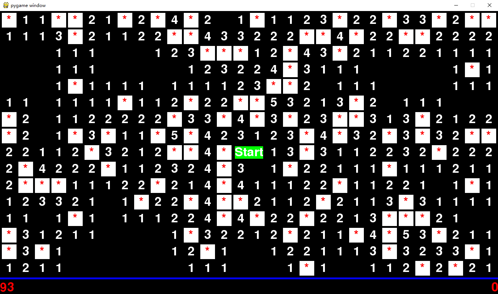

# 扫雷
基于python实现的扫雷
## 运行
```
pip install pygame
python3 main.py
```
<br>

## 操作
左键打开方块<br>
右键放置标记<br>
中键自动打开方块
## 难度选择
在settings.py可以更改设置<br>
初级
```python
self.board_size = (9, 9)
self.mine_count = 10
```
中级
```python
self.board_size = (16, 16)
self.mine_count = 40
```
高级
```python
self.board_size = (30, 16)
self.mine_count = 99
```
也可以自定义